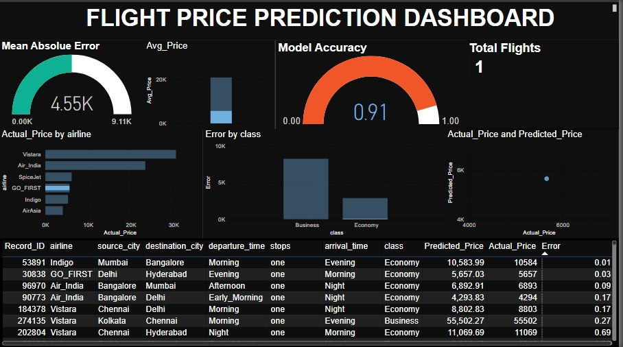

# ✈️ Flight Price Prediction

An end-to-end machine learning project that predicts flight ticket prices based on various features like airline, travel date, source, destination, route, and booking time. The goal is to help users and businesses optimize travel planning using data-driven pricing models.

---

## 📌 Project Overview

- **Objective**: Predict flight ticket prices using supervised machine learning.
- **Dataset**: Flight fare data collected from multiple sources (e.g., airline websites, travel APIs, Kaggle).
- **Goal**: Train regression models to achieve accurate and explainable predictions.

---

## 🧪 Key Components

### 🧼 1. Data Collection & Preprocessing
- Collected flight price data from public sources
- Cleaned and prepared dataset using:
  - **Pandas**, **NumPy**
  - Handling missing values, formatting dates, extracting features

### 📊 2. Exploratory Data Analysis (EDA)
- Visualized distribution of ticket prices
- Analyzed relationships between price and features like airline, stops, duration, etc.
- Tools: `Matplotlib`, `Seaborn`, `Plotly`

### 🤖 3. Model Development
- Trained and compared multiple regression models:
  - Linear Regression
  - Random Forest Regressor
  - XGBoost Regressor
- Used metrics like:
  - RMSE (Root Mean Squared Error)
  - R² Score (Coefficient of Determination)
- Performed **hyperparameter tuning** using GridSearchCV

### 📈 4. Model Evaluation
- Visualized predictions vs actual prices
- Evaluated model robustness and generalization
- Saved best model using `joblib` / `pickle`

---

## 🧰 Tech Stack

- **Language**: Python
- **Libraries**: Pandas, NumPy, Scikit-learn, XGBoost, Matplotlib, Seaborn
- **Tools**: Jupyter Notebook, Git, VS Code

---
---

## 📊 Results

- **Best Model**: XGBoost Regressor
- **Performance**:
  - RMSE: *[e.g. 1200.50]*
  - R² Score: *[e.g. 0.89]*
- Good generalization across test samples
- Insights into which factors impact ticket prices most (e.g., airline, duration, stops)

---

## 🚀 Future Work

- Deploy model via Flask/Streamlit web app
- Add real-time flight price scraping using APIs
- Integrate interactive dashboards (Power BI / Plotly Dash)
- Model explainability via SHAP

---

## 📎 Resources

- 📘 Dataset Source: [Kaggle Dataset](https://www.kaggle.com/datasets/shubhambathwal/flight-price-prediction)
- 🛠 Tooling: Jupyter, VS Code, Git, GitHub
- 📊 Power BI Dashboard:

---

## 🙌 Acknowledgements

- Thanks to open data providers and the data science community for valuable tutorials and datasets.

---

## 📬 Contact

**M IJAZ HUSSNAIN**  
📧 mijazhussnain83.email@.com 

---

⭐ **If you found this helpful, please star this repo!**
